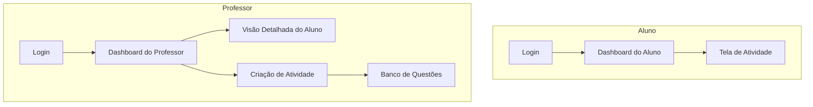
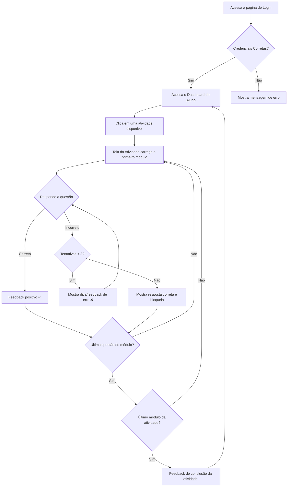

# Dimidui MVP UI/UX Specification

## Introduction
This document defines the user experience goals, information architecture, user flows, and visual design specifications for the Dimidui MVP user interface. It serves as the foundation for visual design and frontend development, ensuring a cohesive and user-centered experience based on the approved PRD.

### Overall UX Goals & Principles

#### Target User Personas
- **Aluno (4º-6º ano)**: Usuário primário. Crianças que precisam de uma experiência de aprendizado engajadora, com feedback claro e imediato, e uma interface visualmente limpa que não cause distrações.
- **Professor**: Usuário secundário. Educadores que necessitam de uma ferramenta eficiente para criar conteúdo, atribuir atividades e monitorar o progresso da turma de forma rápida e intuitiva.

#### Usability Goals
- **Facilidade de Aprendizagem**: Um novo aluno deve conseguir fazer login e iniciar sua primeira atividade em menos de 2 minutos, sem ajuda externa.
- **Eficiência de Uso**: Um professor deve ser capaz de criar uma nova atividade com 3 módulos em menos de 5 minutos, utilizando o banco de questões.
- **Prevenção de Erros**: A interface deve guiar o usuário para evitar ações acidentais, especialmente na criação e gestão de conteúdo pelo professor.

#### Design Principles
1.  **Clareza Acima de Tudo**: A interface deve ser imediatamente compreensível para crianças, com ícones claros e texto legível (Atkinson Hyperlegible).
2.  **Feedback Imediato**: Cada ação do usuário, seja uma resposta em uma atividade ou um clique em um botão, deve ter uma resposta visual ou auditiva instantânea.
3.  **Progressão Encorajadora**: O design deve celebrar as conquistas do aluno (respostas corretas, atividades concluídas) para motivar a continuidade.
4.  **Consistência Visual**: Todos os módulos e telas devem compartilhar os mesmos componentes e padrões de design para criar uma experiência coesa.

### Change Log
| Date       | Version | Description                | Author      |
|------------|---------|----------------------------|-------------|
| 2025-10-06 | 1.0     | Versão inicial do documento | Sally, UX Expert |

---

## Information Architecture (IA)

### Site Map / Screen Inventory


### Navigation Structure
- **Aluno**: A navegação é linear. Após o login, o aluno está em seu dashboard. Clicar em uma atividade o leva para a tela de atividade. Um botão "Voltar" o retorna ao dashboard.
- **Professor**: A navegação é centralizada no Dashboard do Professor, que contém links para as principais seções: Desempenho Individual, Lista de Alunos, e botões de ação para "+ Novo Aluno" e "+ Nova Atividade".

---

## User Flows

### Flow: Aluno Realiza uma Atividade
**User Goal:** O aluno quer fazer login, escolher uma atividade e completá-la.



### Flow: Professor Cria uma Atividade
**User Goal:** O professor quer criar uma nova atividade com módulos do banco de questões.

```mermaid
graph TD
    A[Acessa o Dashboard do Professor] --> B[Clica em "+ Nova Atividade"];
    B --> C[Preenche metadados da atividade];
    C --> D[Clica em "+ Adicionar Módulo"];
    D --> E[Escolhe "Usar do Banco de Questões"];
    E --> F[Seleciona questões em uma modal];
    F --> G{Adicionar mais módulos?};
    G -- Sim --> D;
    G -- Não --> H[Clica em "Preview"];
    H --> I[Visualiza a sequência de módulos];
    I --> J[Clica em "Salvar"];
    J --> K[Atividade é salva no sistema];
    K --> A;
```

---

## Wireframes & Mockups
**Primary Design Files:** As maquetes de alta fidelidade e protótipos serão criados no Figma. (Link a ser adicionado).

### Key Screen Layouts

#### Screen: Dashboard do Professor
- **Purpose**: Fornecer uma visão geral rápida da saúde da turma e acesso a ações principais.
- **Key Elements**: KPIs em cards, gráfico de barras para habilidades BNCC, lista de alunos pesquisável/filtrável, botões de ação primários.
- **Interaction Notes**: Clicar em um aluno na lista navega para sua tela de detalhes.

#### Screen: Criação de Atividade
- **Purpose**: Permitir que professores montem atividades de forma modular.
- **Key Elements**: Formulário de metadados, área de "esteira" para adicionar e reordenar módulos, botões para adicionar módulos, botão de preview e salvar.
- **Interaction Notes**: A adição de módulos abre uma modal para configuração ou seleção do banco de questões.

---

## Component Library / Design System
**Design System Approach:** Para o MVP, criaremos um conjunto de componentes reutilizáveis e simples, definidos em `modules.css`. Não haverá um sistema de design formal ou framework de componentes.

### Core Components
- **Button**: Variantes para `primary` (ação principal, ex: Salvar), `secondary` (ações de suporte, ex: Cancelar), e `destructive` (ex: Remover).
- **Card**: Contêiner padrão com borda e sombra para agrupar informações (ex: KPIs, lista de alunos).
- **Modal**: Janela flutuante para configurações complexas, como a seleção de questões do banco.
- **Input/Textarea**: Campos de formulário padronizados.
- **Badge**: Etiquetas coloridas para status ou categorias (ex: habilidades BNCC).

---

## Branding & Style Guide

### Color Palette
| Color Type | Hex Code | Usage |
|---|---|---|
| Primary | `#6B46C1` | Cor principal da marca, botões primários, links. |
| Primary Light | `#9F7AEA` | Variação para estados de hover ou elementos secundários. |
| Action Primary | `#F6AD55` | Botões de ação importantes que precisam de destaque. |
| Correct | `#48BB78` | Feedback de sucesso, respostas corretas. |
| Incorrect | `#F56565` | Feedback de erro, respostas incorretas. |
| Warning | `#ED8936` | Alertas, avisos importantes (ex: aluno com baixo desempenho). |
| Neutral (Text) | `#2D3748` | Cor principal do texto. |
| Neutral (Surface) | `#FFFFFF` | Fundo de cards e seções principais. |
| Neutral (Background) | `#E8EDF2` | Cor de fundo geral da aplicação. |

### Typography
- **Primary Font Family**: Atkinson Hyperlegible
- **Type Scale**: A ser definido, mas com uma hierarquia clara (H1, H2, H3, Body, Small).

### Iconography
- **Icon Library**: Lucide SVG
- **Usage Guidelines**: Ícones devem ser usados para reforçar a ação de botões e para indicar status, sempre acompanhados de texto quando o significado não for universal.

---

## Accessibility Requirements
**Compliance Target:** Sem um alvo de conformidade WCAG formal para o MVP. No entanto, as melhores práticas serão aplicadas.

### Key Requirements
- **Visual**: O contraste de cores entre texto e fundo deve ser verificado. A fonte Atkinson Hyperlegible foi escolhida especificamente para melhorar a legibilidade.
- **Interaction**: A navegação por teclado deve ser possível para os principais fluxos.
- **Content**: Rótulos de formulário (`<label>`) devem ser associados aos seus respectivos campos de entrada.

---

## Next Steps

### Immediate Actions
1.  Revisar e aprovar esta especificação de UI/UX.
2.  Proceder para a criação do documento de arquitetura de front-end.

### Design Handoff Checklist
- [x] All user flows documented
- [x] Component inventory complete
- [x] Accessibility requirements defined
- [x] Responsive strategy clear
- [x] Brand guidelines incorporated
- [x] Performance goals established
